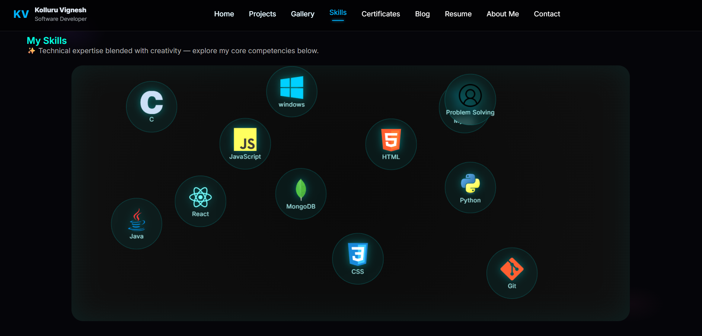
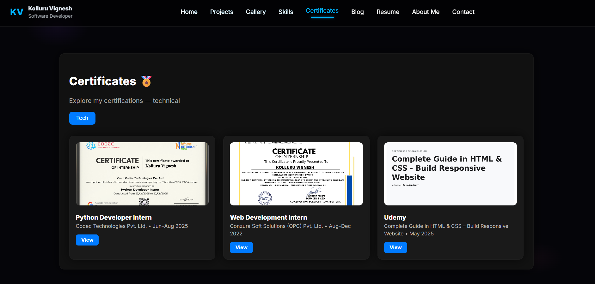

# 💻 Kolluru Vignesh — Portfolio Website
This repository contains my personal portfolio website, designed to showcase my projects, technical skills, internship experience, certifications, and resume. The portfolio is built with a clean and responsive design using modern web development technologies.

🌐 **Website:** [Vignesh Portfolio](https://vignesh-portfolio10.netlify.app/)


🖼️ **Screenshots**






---

## 🚀 Features

* 🎨 **Modern UI/UX** with black-ba aesthetic theme
* ⚡ Smooth **Framer Motion** animations
* 💼 **Projects, Resume, and Contact sections**
* 🧠 Tech-focused portfolio highlighting AI/ML projects
* 📨 Functional contact form powered by **EmailJS**
* 🧩 Responsive design for all screen sizes

---

## 🛠️ Tech Stack

| Category            | Tools / Libraries                        |
| ------------------- | ---------------------------------------- |
| **Frontend**        | React.js, HTML5, CSS3, JavaScript (ES6+) |
| **Styling**         | Tailwind CSS / Custom CSS                |
| **Animation**       | Framer Motion                            |
| **Contact Form**    | EmailJS                                  |
| **Version Control** | Git & GitHub                             |
| **Deployment**      | Vercel / Netlify                         |

---

## ⚙️ Setup Instructions

To run this project locally:

```bash
# 1️⃣ Clone the repository
git clone https://github.com/Vigneshkolluru101103/My-Portfolio

# 2️⃣ Navigate to project directory
cd My-portfolio

# 3️⃣ Install dependencies
npm install

# 4️⃣ Run development server
npm start or npm run dev
```

Now open [http://localhost:3000](http://localhost:3000) in your browser 🚀

---

## 📬 Contact

If you’d like to collaborate or just say hi 👋, feel free to reach out!

* 📧 **Email:** [vigneshkolluru10@gmail.com](mailto:vigneshkolluru10@gmail.com)


---

## 🌟 Deployment

Deployed seamlessly on **Vercel** for continuous integration and fast CDN delivery.
Every push to the `main` branch triggers an automatic rebuild and deployment.

---

